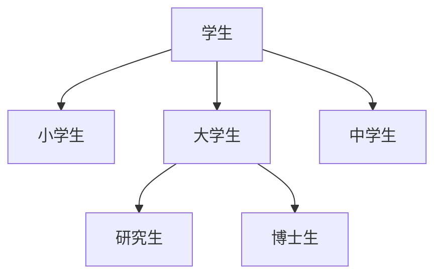

# 类和对象的概念

+ 类是对同一个事物高度的抽象, 类中定义了这一类对象所应具有的静态属性(属性)和动态属性(方法) 
+ 对象是类的一个实例, 是一个具体的事物
+ 类和对象是抽象与具体的关系
+ 类其实就是一种数据类型, 它的变量就是对象

# 类和类之间的关系–继承关系


A是B

如果这句话能说的通, 在设计程序的时候就可以看成是继承关系



# 多态


# OC与面向对象

+ 对象是OC程序的核心, “万事万物皆对象”是程序中的核心思想
+ 类是用来创建同一类型的对象的“模板”, 在一个类中定义类该类所具有的成员变量以及方法
+ 类可以看作是静态属性 (实例变量) 和 动态属性 (方法) 的结合体
+ IOS SDK 里面提供了大量供编程人员使用的类, 编程人员也可以定义自己的类

# OC类的声明和实现 

## 类的声明

```objective-c
@interface MewClassName: parentClassName {
    实例变量: 
    ...
} 
	方法的声明: 
	...
@end
```

## 类的实现

```objective-c
@implenttation NewClassName {
    方法的实现:
    // code
} 
@end
```


## 举例

> 用@interface 来声明一个类, 冒号表示继承关系 
>
> 冒号后面的是类的父亲
>
> NSObject是所有类的父亲
>
> @end关键字结束

+ 类的声明放在“类名 + .h” 的文件中, 如: Person.h 文件
+ 类的声明主要由两部分组成: 实例变量 和 方法
+ 声明实例变量的格式: 变量类型 变量的名称  如: int age


