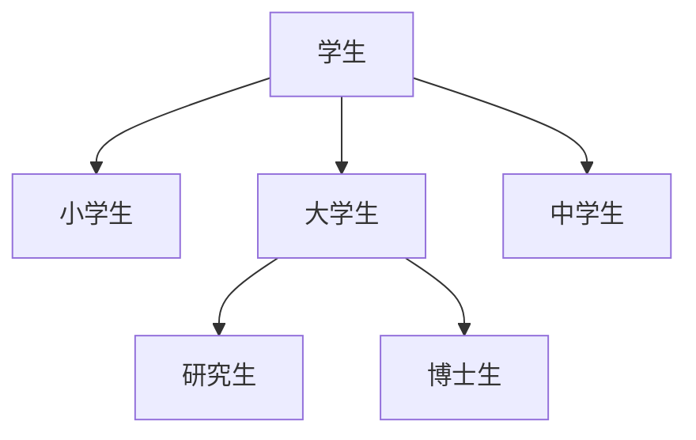

# 类和对象的概念

+ 类是对同一个事物高度的抽象, 类中定义了这一类对象所应具有的静态属性(属性)和动态属性(方法) 
+ 对象是类的一个实例, 是一个具体的事物
+ 类和对象是抽象与具体的关系
+ 类其实就是一种数据类型, 它的变量就是对象


# 类和类之间的关系–继承关系


A是B

如果这句话能说的通, 在设计程序的时候就可以看成是继承关系




# OC与面向对象

+ 对象是OC程序的核心, “万事万物皆对象”是程序中的核心思想
+ 类是用来创建同一类型的对象的“模板”, 在一个类中定义类该类所具有的成员变量以及方法
+ 类可以看作是静态属性 (实例变量) 和 动态属性 (方法) 的结合体 
+ IOS SDK 里面提供了大量供编程人员使用的类, 编程人员也可以定义自己的类

# OC类的声明和实现

## 类的声明

```objective-c
@interface NewClassName : NSObjuct {
    实例变量: 
    ...
} 
	方法的声明: 
	...
@end
```

## 类的实现

```objective-c
@implenttation NewClassName {
    方法的实现:
    // code
} 
@end
```


## 举例

> 用@interface 来声明一个类, 冒号表示继承关系 
>
> 冒号后面的是类的父亲
>
> NSObject是所有类的父亲
>
> @end关键字结束

+ 类的声明放在“类名 + .h” 的文件中, 如: Person.h 文件
+ 类的声明主要由两部分组成: 实例变量 和 方法
+ 声明实例变量的格式: 变量类型 变量的名称  如: int age


# 类和对象

类是面向对象的重要内容, 我们可以把类当成一种自定义数据类型, 可以使用类来定义变量, 这种类型的变量相当于指针类型的变量, 也就是说, 所有的类都是指针类型的变量 

## 定义类

面向对象的程序设计过程中有两个重要概念, 类和对象, 也称为实例 ,其中类是某一批对象的抽象, 可以把类理解为某种概念; 对象才是一个具体存在的实体

类和对象是面向对象的核心, Objective-C提供了创建类和创建对象的语法支持 

Objective-C中定义类需要分为两个步骤: 

+ 接口部分: 定义该类包含的成员变量和方法 
+ 实现部分 : 为该类的方法提供实现 

##OC类的声明和实现

## 类的声明

```objective-c
@interface MyClass: parentClassName {
    实例变量: 
    int count; 
    id data; 
    NSString name; 
} 
	方法的声明: 
	-(id)initWithString : (NSString*)aName; 
	+(Myclass)createMyClassWith : (NSString*)aName;  
@end
```

**注: 在objective-C中, id 是一种特殊的对象类型, 它本质上是一个指向任意对象的通用指针类型, 可以指向任何Objective-C对象, 无论其具体类是什么**

## 类的实现

```objective-c
@implenttation NewClassName {
    方法的实现:
    // code
} 
@end
```

在上面的语法格式中, @interfce 用于声明定义类的接口部分, @end 表明定义结束.其中紧跟该类的一对花括号用于声明该类的成员变量; 花括号后面的部分用于声明该类的方法. 

对于面向对象编程来说, 成员变量和方法都是非常重要的概念, 其中

+ 成员变量: 用于描述该类的对象的状态数据, 比如, 定义一个人, 可能需要关心此人性别, 年龄, 身高等状态的数据,那么就可以将这些状态定义为成员变量 
+ 方法: 用于描述该类的行为, 比如, 程序需要关心人具有走路, 吃饭, 工作等行为, 那么程序就应该为人这个类声明走路, 吃饭, 工作等方法 

一般把定义类的接口声明部分放在头文件中, 也就是说, 定义类接口部分的源代码应该命名为 .h 文件 

## 方法的声明 

```objective-c
-(void)insertObject : (id)anObject  atIndex : (NSUInteger) index
```

**注: 在objective-C中, `NSUInteger` 是 Objective-C 和 Foundation 框架中非常常用的**数据类型**，用于表示**无符号整数**（即只能是非负数：0, 1, 2, ...）。** 

语法说明如下: 

> + 方法类型标识: 该标识符号要么是“+”, 要么是 “-”, +表示该方法是类方法, 直接用类名即可调用; -代表该方法是实例方法, 必须用对象才能调用 
> + 方法返回值类型: 返回值类型可以是objective-C允许的任何数据类型, 包括基本类型, 构造类型和各种指针类型, 如果声明了方法的返回值类型, 则方法体内必须有一个有效的return语句, 如果一个方法没有返回值, 则必须使用void来声明没有返回值 
> + 方法签名关键字: Objective-C的方法签名关键字有方法名, 形参标签和冒号组成.方法名命名规则与成员变量命名规则基本相同
>
> Objective-C的方法声明中, 所有的类型,(包括 void)都应该使用圆括号括起来, 这是0bjective-C方法 与C函数的区别之处 

**接口部分只是声明方法, 并没有为方法提供方法体, 因此需要在方法声明后添加一个分号, 用于表示方法声明结束** 

## 方法的实现

```objective-c
@implementation Myclass { 
    // 成员变量
    int count; 
    id data; 
    NSString name; 
} 
-(id)initWithString : (NSString*)aName {
    // 方法体
} 
+(MyClass*)createMyClassWithString : (NSString*)aName {
    // 方法体
} 
@end 
```

> + 类实现部分的类名必须与类接口部分的类名相同, 用于表示这是同一个类的接口部分和实现部分
> + 类实现部分也可以在类名后使用,  “: 父类” 来表示继承了某个父亲, 但一般没有必要,
> + 在类实现部分也可以声明自己的成员变量,但这些成员变量只能子啊当前类内访问.因此, 在类实现部分声明成员变量相当于定义隐藏的成员变量  
> + 类实现部分必须为类声明部分的每个方法提供方法定义, 方法定义有方法签名(不要在后面用分号) 和方法体组成; 实现部分除了实现类接口部分定义的方法之外, 也可以提供附加的方法定义–这些没有在接口部分, 而是在实现部分定义的方法, 将只能在类实现部分使用: 方法体里多条可执行性语句之间有严格的执行顺序, 排在方法体前面的语句总是先执行, 排在方法体后面的语句总是后执行 

**在接口部分定义的内容(包括成员变量和方法)都是可以暴露且可以供用户调用的部分: 实现部分则是属于该类的内部实现, 对于外界而言是隐藏的, 因此不能供外界调用** 


### 定义一个FKPerson类的接口部分(在FKPerosn.h文件中)

```objective-c
#import<Foundation/Foundation.h>
@interface FKPerson : NSObject {
    // 定义两个成员变量
    NSString* name;
    int age;
}
// 定义一个setName : andAge: 方法
- (void) setName : (NSString*) name andAge : (int) age;
 
// 定义一个say: 方法,
- (void) say : (NSString*) content;
// 定义一个不带形参的info方法
- (NSString) info;
// 定义一个类方法
+ (void) foo;
@end
```

### FKPerosn的实现部分 

```objective-c
#import"FKPerson.h"

@implementation FKPerson {
    //定义一个只能在实现部分使用的成员函数,(被隐藏的成员变量)
    int testAttr;
}

// 定义一个setName: andAge:方法
- (void) setName : (NSString*) n andAge: (int) a {
    name = n;
    age = a;
}

// 定义一个 say: 方法
- (void) say: (NSString*) content {
    NSLog(@"%@", content);
}

// 定义一个不带形参的info方法
- (NSString*) info {
    [self test];
    return [NSString stringWithFormat: @"myname is %@, age is %d", name, age];
}

// 定义一个只能在实现部分使用的方法 (被隐藏的方法)
- (void) test {
    NSLog(@"-- 只能在实现部分使用的test方法 --");
}

// 定义一个类方法
+ (void) foo {
    NSLog(@"FKPerson类的类方法, 通过类名调用");
}
@end
```

**在info中, 调用的stringWithFormat: 类方法(直接通过类名调用的类方法), 该方法的作用是将多个变量 “镶嵌” 到字符串中输出**

## 对象的产生和使用 

定义类之后,接下来就是使用类了, 可以从以下几个方面来使用类 

+ 定义变量 
+ 创建变量 
+ 调用类方法

**定义变量**

```objective-c
类名* 变量名
```

**创建对象** 

```objective-c
[类名 alloc] 初始化方法
```

**alloc是Objective-C的关键字, 负责为该类分配内存空间, 创建对象, 除此之外, 还需要调用初始化方法对该类实例执行初始化**, 由于所有类都继承了NSObject类, 因此**所有的类都有一个默认的初始化方法: init**  

Objective-C也支持使用 new 来创建对象 

```objective-c
[类名 new]; 
```

> `[FKPerson alloc]init` 等价于 `[FKPerson new]` 

**调用类方法** 

```objective-c
[调用者 方法名: 参数 形参标签: 参数值 ...]; 
```

Objective-C规定, 实例方法(以 - 声明的方法) 必须用实例来调用, 而类方法(以 + 声明的方法) 则必须使用类调用

```objective-c
int  main(int argc, const char* argv[]) {
    @autoreleasepool {
        // 定义FKPerson* 类型的变量
        FKPerson* person;
        // 创建FKPerson对象, 赋给perosn变量
        person = [[FKPerson alloc]init];
        
        [person say: @"hello world"];
        [person setName: @"John" andAge: 500];
        NSLog(@"%@", [person info]); 
        [FKPerson foo]; 
    }
    return 0;
}
```

**方法foo必须通过类名调用** 

**test方法只能通过info调用**

输出:

```objective-c
hello world
-- 只能在实现部分使用的test方法 --
myname is John, age is 500
FKPerson类的类方法, 通过类名调用
```

> 大多数时候, 定义一个类就是为了重复创建该类的实例, 同一个类的多个实例具有相同的特征, 而类则是定义了多个实例的共同特征,从某个角度看, 类定义的是多个实例的特征, 因此类不是具体存在的, 实例才是具体存在的

## 对象和指针 

FKPerson* 类型的变量本质就是一个指针变量 ,也就是说, person变量仅仅保存了FKPerson对象在内存中的首地址, 可以认为FKPerson* 类型的变量指向实际的对象 

从本质上说, 类也是一种指针类型的变量 ,因此, 程序中定义的FKPerson* 类型只是存饭一个地址, 它被保存在main()函数的动态存储区, 它指向实际的FKPerson对象, 而真正的FKPerson对象则存放在堆内存中. 

## 成员变量

成员变量指的是在类接口部分或实现部分定义的变量, Objective-C的成员变量都是实例变量, 并不支持真正的类变量 

实例变量从该类的实力被创建开始起存在, 知道系统完全销毁这个实例, 实例变量的作用与对应实例的生存范围相同, 实例变量则可以理解为实例成员变量, 它作为实例的一个成员, 与实例共存亡  

只要实例存在 ,程序就可以访问该实例的实例变量, 在程序中访问实例变量通过如下语法

```objective-c
实例->实例变量
```

成员变量无须显示初始化,只要为一个类定义了实例变量, 系统会为实例变量执行默认初始化, 基本类型的实例变量默认被初始化为 0 , 指针类型的成员变量默认被初始化为 nil 

