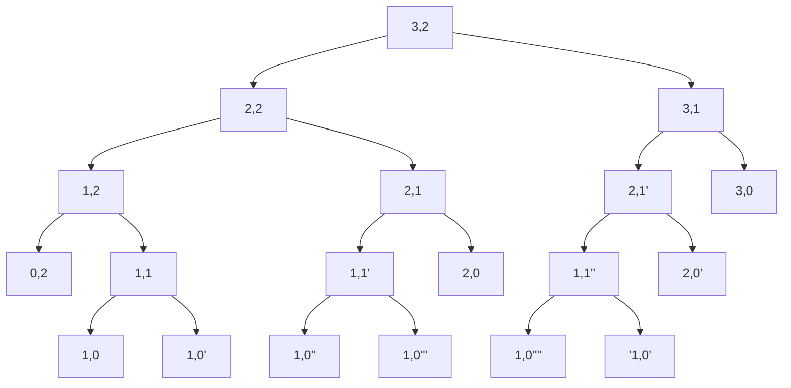

# 3G一面题解

---

# 1. Hello World & 3G

```c
 #include<stdio.h>
 #include<string.h>
 int main() {
     int a = sizeof(int) - sizeof(char); //4-1=3
     char str[] = "Good"; 
     char G = str[strlen(str) - 4]; 
     int b = strlen ("Hello world and hello 3G!");
     int c = sizeof("Welcome to 3G lab!!");
     printf("Hello %d%c %d%d\n", a, G, c, b);
     return 0;
 }
```

sizeof(int) 的值是4 ， sizeof（char）的值是1； 所以a的值是3;

strlen(str) 的值是4, 所以G是str[0],也就是字符 'G'

sizeof计算的是字符串所占字节数,会包括末尾的 '\0', 所以c 的值是20;

strlen计算的是字符串的长度,不会包括末尾的 '\0' ,所以b的值是25;

综上:输出 Hello 3G 2025

# 2.常量不常 局部不局

---

```c

#include <stdio.h>
const int MAX_VALUE = 100;
void test_function() {
    static int call_count = 0;
    int local_var = 10;
    call_count++; //1
    local_var++; //11
    printf("static = %d, local = %d\n", call_count, local_var); //static=1,local=11
    if (call_count == 1) {
    int local_var = 50;
    printf("scope1: local_var = %d\n", local_var); //50
    printf("Hello 3g\n");
  	} else {
      printf("scope2: local_var = %d\n", local_var); 
    }
 }
 int main() {
    const int MAX_VALUE = 200;
    printf("MAX_VALUE: %d\n", MAX_VALUE); //200
    test_function();
    test_function();
    return 0;
 }
```


输出：

```c
 MAX_VALUE: 200
 static = 1, local = 11
 scope1: local_var = 50
 Hello 3g
 static = 2, local = 11
 scope2: local_var = 11
```

> 被 static 修饰的局部变量存储在静态存储区，在程序运行期间一直存在，不会因为函数调用结束而销毁 。
> 只初始化一次：在第一次进入函数时，对静态局部变量进行初始化，后续再次调用该函数时，
> 不再进行初始化，而是保留上一次函数调用结束时的值。
>

所以call_count在第一次调用test_function函数后自增,值变为1,执行 if 语句; 第二次调用test_function函数时不再改变call_count的值,call_count的初始值即为1,再进行自增值变为2;执行else语句

而 local_var 前面没有static修饰,所以每一次调用test_function函数 local_var 都会初始化为10; 然后自增为11; 第一次执行if语句local_var被初始化为50,所以输出

static=1, local=11
scope1: local_var = 50

Hello 3g  第二次执行else语句,直接输出local_var的值,所以输出

static=2, local=11
scope2: local_var = 11

# 3.我本是魔丸，定要学习无符号整形助我破鼎

```c
 C 语言关于浮点数你了解哪些
 int main()
  {
     float f1 = 2011.0f / 3.0f;
     double d1 = 2011.0 / 3.0;
     double d2 = 2011.0f / 3.0;//d2使用了float后缀，但d2是double类型，会进行类型提升
     printf("f1 = %.10f\n", f1);
     printf("d1 = %.20lf\n", d1);
     printf("d2 = %.20lf\n", d2);
     if (d1 == d2) {
         printf("d1 == d2\n");
     } else {
         printf("d1 != d2\n");
     }
     return 0;
  }
```

> - **float（单精度）**：
>   - 占用 4 个字节（32 位）
>   - 有效数字约为 **6-7 位**（二进制存储转换为十进制后的近似值）
>   - 例如，对于小数部分，它能精确表示的十进制小数位数通常不超过 6 位
> - **double（双精度）**：
>   - 占用 8 个字节（64 位）
>   - 有效数字约为 **15-17 位**
>   - 例如，对于小数部分，它能精确表示的十进制小数位数通常不超过 15 位


输出:

```c
 f1 = 670.3333129883
 d1 = 670.33333333333337000000
 d2 = 670.33333333333337000000
 d1 == d2
 
 请按任意键继续. . .
 
```

虽然2011.0使用了f后缀,但3.0默认是double型,在运算时d2进行了类型提升// 编译器自动将 float 提升为 double;
	`double temp = (double)2011.0f;  // 隐式类型转换,`

所以最终d1 == d2

#  4.别犯傻了，赫里内勒多，代码不进if很正常

---


```c
代码会输出什么，了解过逻辑运算符短路吗
#include <stdio.h>
 int main() {
    int i = 0, j = 0;
    if (i++ && ++j){ //0  1逻辑与，前者为0，后面不计算
        j = j >> 2;
        printf("if branch: i = %d, j = %d\n", i, j);
    } else {
        i = i << 2;	  //i=1,j=0
        // i=1
        // 00000001
        // 00000100
        printf("else branch: i=%d, j=%d\n", i, j);//4 0
    }
    return 0;
}
```

后置 ++ ,先使用再 ++ , 开始时 i  为 0, 判断为 假, 不执行 j ++; 进入 else 语句, 此时i 为 1, j 为 0; 再执行 i = i << 2; 相当于 乘以 4 , 最终 i = 4 ; j = 0; 

#  5.虽然都是小case，但到底应该落在哪个case里呢

----

```c
#include <stdio.h>
 int process(int num) {
    while (1) {
        switch (num) {
            case 0:
                num = (num ^ 123 ^ 87) | 16;
            case 1:                         // 123  01111011
                num = num ^ 15;             // 87   01010111  
                break;                      // ^^   00101100
            case 2:                         // 16   00010000
                --num;                      // |16  00111100  4+8+16+32=60      
            case 3:                         // 15   00001111 
                num = num + 1;              //  ^   00110011  1+2+16+32=51 
                break;                      //  00000001<<5
            case 4:                         //  00100000   
                num = num + 1;                                      
            case 5:
                return (1 << num);
            case 6:
                num = num - 3;
                break;
            case 10:
                num = num - 6;
                break;
            case 15:
                num = num / 3;
                break;
            default:
                num = (num % 2) ? (num- 1) : (num / 2);
        }
    }
 }
int main() {
    int start = 0;
    int answer = process(start); 
    printf("answer = %d\n", answer); 
    return 0;
 }
```

首先 start = 0, 进入 case 0; 执行以下运算

```c
// 123  01111011
// 87   01010111  
// ^^   00101100
// 16   00010000
// |16  00111100  4+8+16+32=60      
```

> 执行完case 0 后没有break; 继续执行 case 1 ; 
>
> ```c
> // 15   00001111 
> //  ^   00110011  1+2+16+32=51 
> ```

> 执行完case 1 后,break 跳出switch; 

> 此时num = 51;  进入default ;51 % 2 结果为1, 判断为真, 执行num = num - 1; 

> 此时num = 50;  进入default ;50 % 2 结果为1, 判断为假, 执行num = num / 2; 

> 此时num = 25;  进入default ;25 % 2 结果为1, 判断为真, 执行num = num - 1;

> 此时num = 24;  进入default ;24 % 2 结果为0, 判断为假, 执行num = num / 2;

> 此时num = 12;  进入default ;12 % 2 结果为0, 判断为假, 执行num = num / 2;  

> 此时num = 6;  进入 case 6; 执行 num = num - 3; 

> 此时num = 3;  进入 case 3 ; 执行 num = num + 1;   

> 此时 num = 4; 进入 case 4 ; 执行 num = num + 1; 

> 此时 nun = 5; 进入 case 5 ; 返回  return (1 << num); 相当于 1 乘以 2 的5 次方; 结果为32 ; 
>```c
//      00000001<<5
//      00100000     32
```


所以最终输出 ==answer = 32== 

#  6.递哩哩哩哩哩哩归

---

```c
给出以下代码块，描述输出结果以及原因
 #include <stdio.h>
 int strange(int n, int m) {
    if (n == 0) { //n=3 m=2
        return m;
    } if (m == 0) {
        return n;
    }
        return strange(n - 1, m) + strange(n, m - 1); //strange (2,2)+strabge (3,1)
}                                                 
    int main() {
    int result = strange(3, 2);
    printf("%d\n", result); 
    return 0;
 }
```

初始传入 3 和 2, 进入递归,过程如下: 



所以最终结果为 2 + 1 + 1 + 1 + 1 + 2 + 1 + 1 + 2 + 3 =15; 

输出==15==

#  7.数组指针 指针数组

-----

```c
给出以下代码块，描述输出结果以及原因
#include <stdio.h>
int main() {
    int arr[2][3] = {{1, 2, 3}, {4, 5, 6}};
    int *ptr = arr[0];
    int (*arrPtr)[3] = arr;
    int *ptrArr[2];
    ptrArr[0] = arr[0];
    ptrArr[1] = arr[1];
    printf("*(arr[1] + 2)  = %d\n", *(arr[1] + 2));
    printf("arrPtr[1][1]   = %d\n", arrPtr[1][1]);
    printf("*(*arrPtr + 3) = %d\n", *(*arrPtr + 3));
    printf("*(ptr + 2)     = %d\n", *(ptr + 2));
    printf("arr[0][1]      = %d\n", arr[0][1]);
    printf("ptrArr[0][0]   = %d\n", ptrArr[0][0]);
    return 0;
 }
```

定义了一个二维数组arr[2]\[3]; 

```c
1 2 3
4 5 6
```

又定义了一个指针类型的变量 ptr 只想数组第一行第一个元素, 

一个数组指针指向 arr ;

一个包含两个指针变量的指针数组 ptrArr[2]; 

ptrArr[0]指向 arr数组第一行, ptrArr[1]指向arr数组第二行; 

`*(arr[1] + 2)`arr[1]是指向数组第二行第一个元素的指针, 向后移动 2 位, 指向 第二行第三个元素 6; 

`arrPtr[1][1]` 打印第二行第二个元素 5; 

`*(*arrPtr + 3)` *arrptr是指向arr数组第一行的首地址的指针,向后移动 3 位, 指向第四个元素 4; 

 `*(ptr + 2)` ptr是指向数组第一行第一个元素的地址,向后移动 2 位, 指向 3; 

`arr[0][1]` 打印数组第一行第二个元素 2 ;

`ptrArr[0][0]` ptrarr[0]指向arr数组第一行, ptrArr[0]\[0]就是第一行第一个元素 1 ;

输出:

```c
*(arr[1] + 2)  = 6
arrPtr[1][1]   = 5
*(*arrPtr + 3) = 4
*(ptr + 2)     = 3
arr[0][1]      = 2
ptrArr[0][0]   = 1
```

# 8.函数指针也玩cosplay

------

```c
这样写对比直接声明调用函数有什么好处呢
#include<stdio.h>
 typedef void (*log)(const char* msg);
 void error_log(const char* msg) {
    printf("[ERROR] %s\n", msg);
}
 void debug_log(const char* msg) {
    printf("[DEBUG] %s\n", msg);
 }
 void print_log(log func_log, const char* msg) {
    func_log(msg);
}
int main() {
    const char* msg = "Hello 3G!";
    print_log(debug_log, msg);
    print_log(error_log, "YOLO");
    return 0;
}
```

首先用typedef进行了类型命名, 定义了一个函数指针类型 log, 指向接收 const char* 类型的参数 ,返回 void 的函数 ; 

再分别定义了两个函数, error_log 和 debug_log ; 

调用函数指针的函数,print_log,用来打印; 

`print_log(debug_log, msg);` 调用第一个print_log ,传入debug_log 函数和 字符串 msg; 然后再调用 debug_log函数进行打印, 输出==[DEBUG] Hello 3G!== ;

调用第二个print_log ,传入error_log 函数和 字符串 YOLO; 然后再调用 error_log 函数进行打印, 输出 ==[ERROR] YOLO==

使用函数指针的优点:

> 1. 有同一的控制点, 直接调用的时候无法统一调用所有的函数,每一个函数的调用都是独立的
> 2. 便于添加统一逻辑, 可以在 print_log 中添加全局功能,
> 3. 动态切换日志策略
> 4. 所有日志都通过同一个入口,可以统一添加逻辑
> 5.  统一日志格式、过滤、开关


# 9.宏魔法的隐秘交换术

--------

欢迎来到C语言宏魔法实验室！这里有一段看似简单的交换咒语，却隐藏着宏魔法的深层奥秘。

```c
#include <stdio.h>
#define SQUARE(x) x * x
#define SWAP(a, b, t) do { t = a; a = b; b = t; } while(0)
#define N 4
#define TO_STR(x) #x  //#号  将x转换为字符串
#define MAGIC_CAL(a, b) (SQUARE(a) + SQUARE(b))
#define WELCOME(x) printf("Welcome to " TO_STR(3G) " %d!\n", x)
int main() {
    int i = 2, j = 4, tmp = 0;
    if (SQUARE(++i) == SQUARE(--j))  //16!=4   ++的优先级高于*
        SWAP(i, j, tmp);    //不进入这一步
    printf("i = %d, j = %d\n", i--, j); //i=4  j=2   i=3;j=2;
    WELCOME(SQUARE(i * i) * MAGIC_CAL(i, N)); //3*3=9 9*9=81   81*(9+16)=2025;
    return 0;
}
```

首先进入if 语句, SQUARE(++i) = ++i  * ++ i ; 由于==*==的优先级低于==++==的优先级,所以先执行两次 ++ i;i 变为 4 ; 4 * 4 = 16; 
SQUARE(--j) = – j * – j  ; 同理得 2 * 2 = 4 ; 由于 16 != 4 ; 判断为假,不执行 if 语句; 在peintf语句中, i – 变为 3 ;打印

==i = 3, j = 2==

然后执行`WELCOME(SQUARE(i * i)* MAGIC_CAL(i, N));`  SQUARE(i * i) = SQUARE( 3 * 3) = 9 * 9 = 81; 

  MAGIC_CAL(i, N) = SQUARE ( 3 ) + SQUARE ( 4 ) = 9 + 16 =25; 

所以 SQUARE(i * i)* MAGIC_CAL(i, N)) = 25 * 81 = 2025 ; 

`WELCOME(x) printf("Welcome to " TO_STR(3G) " %d!\n", x)` 输出==Welcome to 3G 2025!==

# 10.到底是几？

----

```c
#include <stdio.h>
 struct SonStruct {
    char ch; // 1
    int val; // 4   8
 };
 struct MyStruct {
    unsigned int bit : 3; // 4
    int* ptr; // 8  16
    union {
        char arr[9]; // 1
        int val; // 4  8
    } unionSon;
    struct SonStruct son; //8
 };
 int main() {
    struct MyStruct s1 = {0}, s2 = {0};
    int number = 8;
    s1.bit = number;
    s1.ptr = &number;
    s1.unionSon.arr[1] = 1;
    s2 = s1;
    printf("Size of MyStruct: %zu\n\n", sizeof(s1));  //40
    printf("bit (3-bit unsigned): %d\n", s1.bit);  //只占3个比特位
    printf("unionSon.val (int): %d\n\n", s1.unionSon.val);  //小端序//256
    printf("After ++(*s1.ptr) & (*s2.ptr)++ : %d %d\n\n", ++(*s1.ptr), (*s2.ptr)++);  //从右向左求值
    printf("Final number value: %d\n", number);  //10
}
```

定义了两个结构体, SonStruct 和 MyStruct ; 并在MyStruct内定义了联合体unionSon;

然后定义了两个 MyStruct 结构体类型变量 s1 和 s2 ,int 类型变量 number = 8; 将number 的值 赋给 s1.bit , 将number 的地址赋给 s1.ptr,将联合体内arr数组的第二个元素赋值为1; 

> printf("Size of MyStruct: %zu\n\n", sizeof(s1));` 输出结构体 MyStruct 的内存大小, 这里需要考虑内存对齐, 
>
> unsigned int bit : 3; 占 4 个字节, int* ptr; 指针变量, 占 8 个字节,对齐数为 8 , 需要填充 4 个字节对齐,
>
>  联合体的特点是共用同一块内存, char arr[9];占 9 个字节, int val 占 4 个字节, 联合体的内存大小由最大成员决定,所以联合体所占内存为 9 , 对齐数为 4 , 因为int* ptr; 结束位置为 16, 满足 4 的整数倍, 不需要填充字节 , 
>
> 结构体SonStruct中 char ch 占一个字节, int val 占 4 个字节, 对齐数为 4 , 需填充 3 个字节对齐, 所以结构体的 SonStruct 所占内存为 8 , 对齐数为 8 , 
>
> unionSon 结束位置 4 + 4 + 8 + 9 = 25; 需补充到 8 的倍数, 填充 7 个字节到 32 ,再加 SonStruct 8 个内存, 所以结构体Mystruct 所占内存为 40 ;

==联合体的对齐要求为成员的最大对齐数 , char arr [9] 的对齐数为 1 , int val 的对齐数为 4 ,所以联合体nuionSon 的对齐数为 4==

`printf("bit (3-bit unsigned): %d\n", s1.bit);`  8 的二进制为 0001， 位域只有三位，只取低3位 000 ， 所以s1.bit 的值为0； 

`printf("unionSon.val (int): %d\n\n", s1.unionSon.val);	 联合体共享内存, 小端序存储, 00 01 00 00 00 00 00 00 00   ,int 类型只读取前 4 个字节， 即 00 01 00 00， 值为 16 ^ 2 =256 ;

` printf("After ++(*s1.ptr) & (*s2.ptr)++ : %d %d\n\n", ++(*s1.ptr), (*s2.ptr)++);` ==C语言函数参数的求值顺序是从右向左的，这是语言标准规定的。== 

> 所以先执行(\*s2.ptr)++;  因为后置 ++ ； 所以先使用再自增，所以打印++(、*s2.ptr)的值为 8,  自增为 9 ；

> 再执行++(\*s1.ptr)； 因为 s2.ptr 和 s1.ptr 指向同一个地址, 所以s1.ptr 的值为 9 , 再自增为10,打印结果为 10 ;

 `printf("Final number value: %d\n", number);` 因为s2.ptr 和s1.ptr 都是指向 number的地址, 所以number 的值已经被修改为10;打印==Final number value: 10==

# 11.水壶问题

--------

> 有两个水壶，容量分别为x 和y升。水的供应是无限的。确定是否有可能使用这两个壶准确得到
> target 升

要确定是否有可能使用这两个壶准确得到target 升,则需要判断 target 是否为x 和 y 最大公约数的倍数, 

先写一个函数通过辗转相除法得到x 和 y 的最大公约数  , 

```c
int divisor(int a, int b) {
    while (a % b != 0) {
        int r = a % b; 
        a = b; 
        b = r;  
    }
    return b; 
}
```

再判断 target 是否为 x 和 y 的最大公约数的整数倍,若是,则可以确定这两个壶准确得到 target 升,反之则不行; 

完整代码如下:

```c
#include<stdio.h>
int divisor(int a, int b) {
    while (a % b != 0) {
        int r = a % b; 
        a = b; 
        b = r;  
    }
    return b; 
}
int main() {
    int x = 0, y = 0; 
    scanf("%d %d", &x, &y);
    int target = 0; 
    scanf("%d", &target); 
    int join = divisor(x , y); 
    if (target % join == 0) {
        printf("Yes\n"); 
    } else {
        printf("No\n"); 
    }
    return 0; 
}
```

# 12.实现你自己的qsort

------

 qsort 是c 语言标准库中的标准排序函数，其主要实现方式为快排，请选择一种你较为了解的排
序方法，现场说说原理，并将其封装为函数，成功实现排序功能。

快速排序:

> 对于给定的一串数字, 选定一个基准 pivot ,然后遍历其他的数字,用每一个数字和基准 pivot 进行比较,如果比 pivot 小,就反到基准的前面,反之放在基准后面, 通过这样的方法确定了pivot 的位置,再对基准两边进行排序,进行递归,从而实现数字从小到大的排序.

函数如下:

```c
void Quick(int *arr, int start, int end) {
    if (start >= end) {
        return; 
    }
    int left = start; 
    int right = end; 
    int pivot = arr[start]; 
    while (left < right) {
        while (left < right && arr[right] >= pivot) {
            right--;  
        }
        arr[left] = arr[right];
        while (left < right && arr[left] <= pivot) {
            left++; 
        }
        arr[right] = arr[left]; 
    } 
    arr[left] = pivot; 
    Quick(arr, start, left - 1); 
    Quick(arr, left + 1, end); 
}
```

