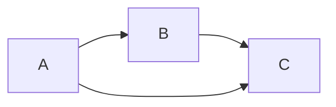

# 链表

---

链表是结构体变量与结构体变量连接在一起

链表由“结点” 组成. “结点” 由“数据部分” 和“指针部分” 组成


## 特点

各个成员“结点” 不是连续存储的. 

最后一个成员的指针是NULL(0); 


链表是由一系列节点组成,每个节点包括两个域, 一个是数据域,数据域用来保存用户数据, 另一个是指针域, 保存下一个结点的地址.链表在内存是得连续的. 


> 链表在指定位置插入和删除不需要移动元素, 只需要修改指针即可
>
> 查找效率较数组低一些
>
> 链表相对于数组来说, 多了指针域空间开销

链表: 静态链表  动态链表

单项链表  双向链表  循环链表  单向循环链表  双向循环链表

**拿到链表的第一个节点, 就相当于拿到整个链表**

## 数组与链表区别

|      | 数组                                                         | 链表                                                         |
| ---- | ------------------------------------------------------------ | ------------------------------------------------------------ |
| 特点 | 一次性分配一块连续的存储区域                                 | 无需一次性分配一块连续的存储区域， 只需分配 n 块节点存储区域，通过指针建立关系 |
| 优点 | 随机访问元素的效率高                                         | 1.不需要一块连续的存储区域<br/>2.删除和插入某个元素效率高    |
| 缺点 | 1. 需要分配一块连续的存储区域<br/>2.删除和插入某个元素的效率低 | 随机访问元素的效率低                                         |

## 静态链表

```c
//链表节点类型定义
struct LinkNode {
    int data; 
    struct LinkNode* next; 
}; 
void test() {
    struct LinkNode node1 = {10, NULL}; 
    struct LinkNode node2 = {20, NULL}; 
    struct LinkNode node3 = {30, NULL}; 
    struct LinkNode node4 = {40, NULL}; 
    struct LinkNode node5 = {50, NULL}; 
    struct LinkNode node6 = {60, NULL}; 

    node1.next = &node2; 
    node2.next = &node3; 
    node3.next = &node4; 
    node4.next = &node5; 
    node5.next = &node6; 

    //遍历链表
    // 先定义一个辅助指针变量
    struct LinkNode* pCurrent = &node1; 
    while (pCurrent != NULL) {
        printf("%d ", pCurrent ->data); 
        pCurrent = pCurrent->next; 
    }
}
int main() {
    test(); 
    return 0; 
}
```

## 动态链表


```c
struct Node {
    int data;               // 指针域
    struct Node* next;      // 数据域
}; 

struct Node* createList() {
    struct Node* headNode = (struct Node*)malloc(sizeof(struct Node)); 
    // headNode 成为了结构体变量
    headNode->next = NULL; 
    return headNode; 
} 

// 创建节点
struct Node* createNode(int data) {
    struct Node* newNode = (struct Node*)malloc(sizeof(struct Node)); 
    newNode->data = data; 
    newNode->next = NULL; 
    return newNode; 
} 

// 头插
// 插入节点， 参数：插入哪个链表， 插入节点的数据
void insertNodebyhead(struct Node* headNode, int data) {
    // 创建插入的节点
    struct Node* newNode = createNode(data); 
    newNode->next = headNode->next; 
    headNode->next = newNode; 
}

//打印节点
void printList(struct Node* headNode) {
    struct Node* pMove = headNode->next; 
    while (pMove != NULL) {
        printf("%d ", pMove->data); 
        pMove = pMove->next; 
    } 
    printf("\n"); 
}

int main() {
    struct Node* list = createList(); 
    insertNodebyhead(list, 1); 
    insertNodebyhead(list, 2); 
    insertNodebyhead(list, 3); 
    printList(list); 
   return 0;  
}
```


​	

#### 以数据为参照

```c
//删除节点， 参数：删除的链表， 参照的数据
void deleteNodebyAppoin(struct Node* headNode, int posData) {
    if (headNode == NULL || headNode->next == NULL) {
        printf("链表为空\n"); 
        return; 
    }
    struct Node* posNode = headNode->next; 
    struct Node* posNodeFront = headNode; 
    
    while (posNode->data != posData) {
        if (posNode->next == NULL) {
            printf("未找到\n");
            return;  
        } 
        posNodeFront = posNode; 
        posNode = posNode->next; 
    } 
    posNodeFront->next = posNode->next;  
    free(posNode); 
    printf("成功删除\n"); 
} 
```

## 定义链表

---


```c
//定义链表
struct Node {
    int data;				//数据域
    struct Node* next; 		// 指针域
}; 
```

## 插入节点

---


### 从头部插入

```c
struct Node* insertNodeathead(struct Node* head, int data) {
    struct Node* newNode = (struct Node* malloc(struct Node)); 
    if (newNode == NULL) {
        printf("内存申请失败\你\n"); 
        return NULL; 
    }
    newNode->next = head; 
    newNode->data = data; 
    return newNode; 
}
```

创建一个节点, 让新节点的指针指向之前的头节点， 这样新创建的节点就成为了新的头节点；

### 从尾部插入

```c
struct  Node* insertNodeattail(struct Node* head, int data) {
    struct Node* newNode = (struct Node*)malloc(sizeof(struct Node)); 
    if (newNode = NULL) {
        printf("内存分配失败\n"); 
        return NULL; 
    }
    newNode->data = data; 
    newNode->next = NULL; 
  	if (head == NULL) {
        return newNode; 
    }
    struct Node* current = head; 
    while (current->next != NULL) {
        current = current->next; 
    }
    current->next = newNode; 
    return head; 
}
```

### 在指定位置插入节点

```c
struct Node* insertatIndex(struct Node* head, int index, int data) {
    struct Node* newNode = (struct Node*)malloc(sizeof(struct Node));  
    if (newNode == NULL) {
        printf("内存申请失败\n"); 
        return NULL; 
    } 
    newNode->data = data;  
    if (index == 0) { 
        newNode->next = head; 
        return newNode; 
    } else {
        int i = 0; 
        struct Node* current = head; 

        for (i = 0; i < index - 1 && current != NULL; i++) {
            current = current->next; 
        }
        if (current == NULL) {
            printf("插入位置无效\n"); 
            free(newNode); 
            return head; 
        } else {
            newNode->next = current->next; 
            current->next = newNode; 
            return head; 
        }
    }
}
```

先创建一个节点 newNode , 并初始化, 在进行判断, 如果要插入链表的位置是链表的表头, 则让新创建的节点的指针指向原来链表的表头 head ; 

如果要插入的位置不在表头, 则定义一个结构体指针 current 来进行定位,再进行循环,找到要插入链表位置的前一个位置,  如果 current 已经到达链表的末尾位置但仍未找到要插入的位置,, 则说明插入的位置无效;

如果找到了要插入位置的前一个位置, 则让新创建的节点的指针指向 current 的下一个节点;让current 指向新创建的节点,就完成了节点的插入; 

## 删除节点

---

```c
struct Node* daleteNode(struct Node* head, int data) {
    
    // 空节点检查
    if (head == NULL) {
        return NULL; 
    }

    // 删除头节点的情况
    if (head->data == data) {
        struct Node* temp = head; 
        head = head->next; 
        free(temp); 
        return head; 
    }

    //查找要删除的节点
    struct Node* current = head; 
    while (current->next != NULL && current->next->data == data) {
        current = current->next; 
    } 
    if (current->next != NULL) {
        struct Node* temp = current->next; 
        current->next == temp->next; 
    } else {
        printf("未找到\n"); 
    }
    return head; 
}
```

要删除某一节点,先判断要链表是否为空，如果链表为空则无法删除返回空指针。

```c
if (head == NULL) {
        return NULL; 
    }
```

在判断要删除的节点是否为头节点，如果是头节点，则让原来链表的第二个节点成为新的头节点,再释放原来头节点的内存.返回新的头节点.

```c
if (head->data == data) {
        struct Node* temp = head; 
        head = head->next; 
        free(temp); 
        return head; 
    }
```

如果要删除的节点不是头节点,则定义一个结构体指针 current ,从第一个节点开始遍历整个链表,找到要删除数据所在节点的前一个节点,再定义一个结构体指针 temp 指向要删除的节点,让current 指向要删除的节点的下一个节点,然后释放要删除的节点的内存.如果 current 遍历整个链表都没有找到,则说明无法找到要删除的节点.

**删除B节点, 直接让A节点指向B节点所指向的节点;**



```c
struct Node* current = head; 
    while (current->next != NULL && current->next->data != data) {
        current = current->next; 
    } 
    if (current->next != NULL) {
        struct Node* temp = current->next; 
        current->next = temp->next; 
        free(temp); 
    } else {
        printf("未找到%d的节点\n", data); 
    }
    return head; 
```

## 查找节点

---

```c
struct Node* SearchNode(struct Node* head, int data) {
    struct Node* current = head; 
    while (current != NULL) {
        if (current->data == data) {
            rerturn current; 
        }
        current = current->next; 
    }
    return NULL; 
}
```

要查找某一数据所在的节点,先定义一个结构体变量,

## 获取链表长度

---

```c
int getLenth(struct Node* head) {
    int lenth = 0; 
    struct Node* current = head; 
    while (current != NULL) {
        lenth++; 
        current = current->next; 
    }
    return lenth; 
}
```

先定义一个结构体指针 current, 让current指向链表的头节点 head ,再定义一个 整形变量 lenth 来计数,让 current 从头节点开始一直向后遍历,每遍历一个节点,lenth 就加1, 当current 遍历到最后一个节点,就lenth 就是链表的长度.

## 修改链表的值

---

### 修改指定值的节点的值

```c
//修改指定值的节点的值
struct Node* updateatIndex(struct Node* head, int olddata, int newdata) {
    struct Node* current = head; 
    while (current != NULL) {
        if (current->data == olddata) {
            current->data = newdata; 
        }
        current = current->next; 
    }
    return head; 
}
```

先通过查找链表的方法找到要修改的值所在的节点,再将该节点的值替换为我们要修改的新的值.

### 修改指定位置的值

```c
// 修改指定位置的值
struct Node* updateatindex(struct Node* head, int index, int data) {
    int i = 0; 
    struct Node* current = head; 
    while (i < index && current != NULL) {
        current = current->next; 
        i++; 
    }
    if (current != NULL) {
        current->data = data; 
    } 
    return head; 
}
```

### 链表反转

```c
struct ListNode {
    int val;
    struct ListNode *next;
};
struct ListNode* reverseList(struct ListNode* head) {
    struct ListNode* prev = NULL;
    struct ListNode* current = head;
    
    while (current != NULL) {
        struct ListNode* nextTemp = current->next;  // 保存下一个节点
        current->next = prev;                       // 反转指针
        prev = current;                             // 移动prev
        current = nextTemp;                         // 移动current
    }
    return prev;  // prev成为新的头节点
}
```

创建一个结构体指针prev为空指针,然后再创建一个指针指向链表的头节点，从头节点开始，把每一个节点按照头插的方法插入到新的链表中，最后将prev指向反转后新链表的表头，作为新链表的表头。


