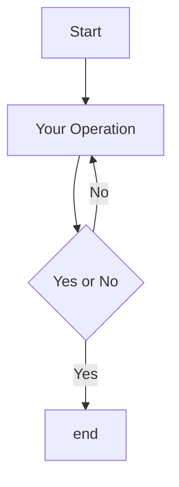
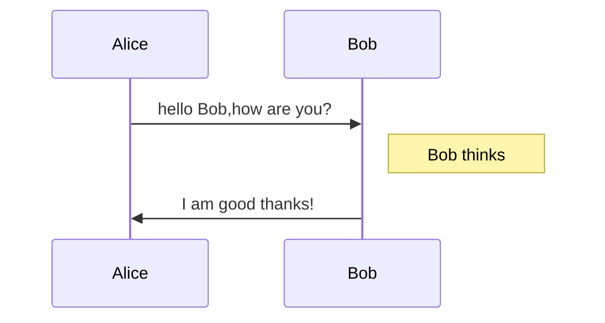
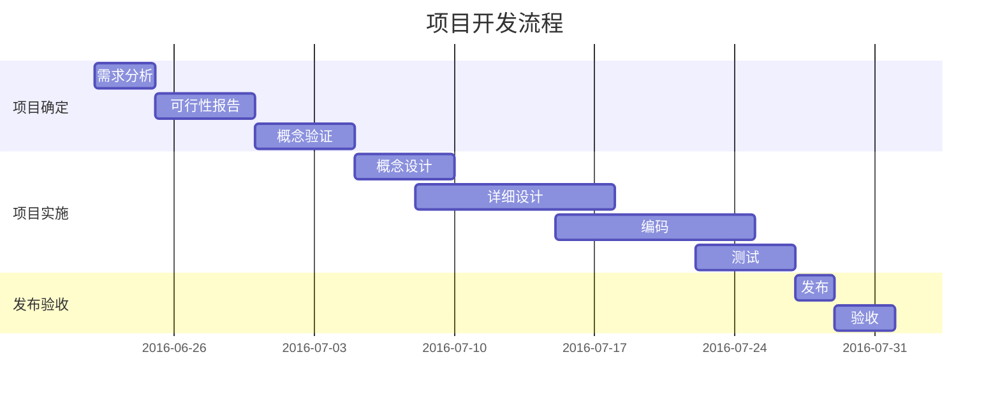

# 制作代办事项

+++

+ [ ] 支持以PDF格式导出文稿
+ [x] 改进 Cml 渲染算法，

# 书写公式

---

用 $$ 包裹表示整行公式

$$ E=mc^2$$  

用$$包裹

# 绘制流程图

---

```mermaid
flowchart TB
    st[Start] --> op[Your Operation]
    op --> cond{Yes or No}
    cond -- Yes --> e[end]
    cond -- No --> op
```

# 序列图

+++

```mermaid
sequenceDiagram
Alice->>Bob:hello Bob,how are you?
Note right of Bob:Bob thinks
Bob->>Alice:I am good thanks!
```

# 甘特图

+++

```mermaid
gantt
	title 项目开发流程
	section 项目确定
		需求分析	:a1,2016-06-22,3d
		可行性报告	:after a1, 5d
		概念验证	:5d
	section 项目实施
		概念设计	:2016-07-05, 5d
		详细设计	:2016-07-08, 10d
		编码		:2016-07-15, 10d
		测试		:2016-07-22, 5d
	section 发布验收
		发布:2d
		验收:3d
```

