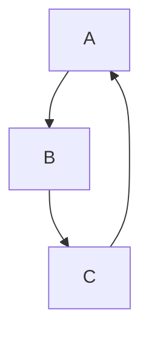
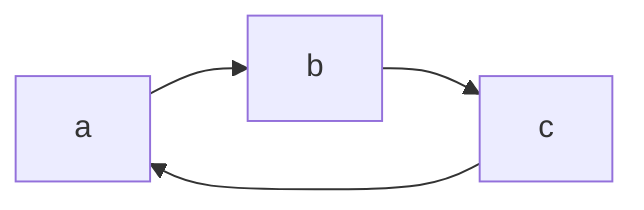
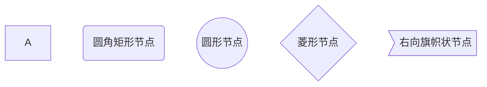
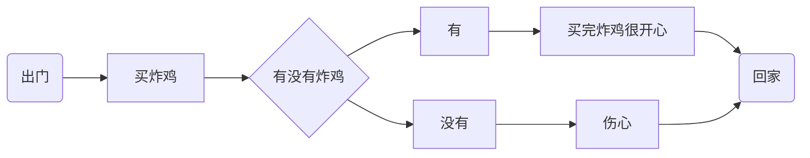
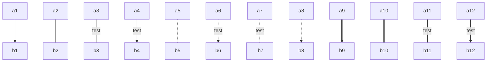
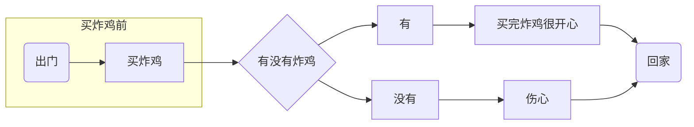

# 流程图

+++

| 用词 | 含义     |
| ---- | -------- |
| TB   | 从上到下 |
| BT   | 从下到上 |
| RL   | 从右到左 |
| LR   | 从左到右 |

> T = TOP , B = BOTTOM , L = LEFT , R = RIGHT 

#### 从上到下




#### 从左到右



## 流程图常用符号及含义

| 表述       | 说明           | 含义                                                |
| ---------- | -------------- | --------------------------------------------------- |
| id[文字]   | 矩形节点       | 表示过程,也就是整个流程中的一个环节                 |
| id(文字)   | 圆角矩形节点   | 表示开始和结束                                      |
| id((文字)) | 圆形节点       | 表示连接.为避免流程过长或有交叉，可将流程切开。成对 |
| id{文字}   | 菱形节点       | 表示判断、决策                                      |
| id>文字]   | 右向旗帜状节点 |                                                     |

单向箭头线段: 表示流程进行方向

> id 即为节点的唯一标识,A——F 是当前节点的名字， 类似于变量名，画图是便于利用
>
> 括号内是节点中要显示的文字， 默认节点的名字和显示的文字都为A





## 连线

graph TB
a1-->b1
a2---b2
a3--test---b3
a4--test-->b4
a5-.-b5
a6-.test.->b6
a7-.test.--b7
a8-.->b8
a9\==>b9
a10=\==b10
a11=\=test=\==b11
a12=\=test==>b12



## 子图表

```mermaind
subgraph 子图表名称
	子图表中的描述语句
end
```




