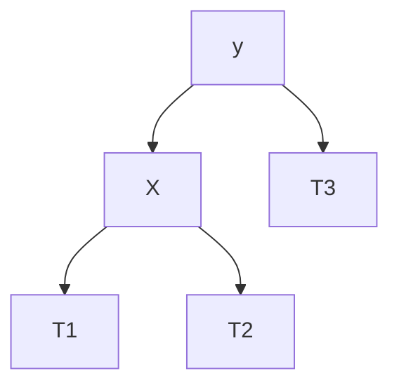
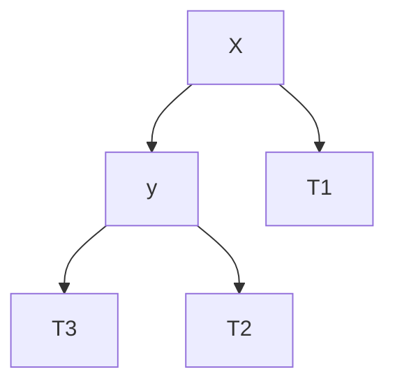

# 二叉平衡树

二叉平衡树是一种自平衡的**二叉搜索树** 

**平衡二叉树不允许重复值**

# 核心概念

二叉平衡树(AVL树)在二叉搜索树的基础上,增加了平衡条件: 

- 每个节点的左右子树高度差不超过 1
- 平很因子 = 左子树高度 - 右子树高度

# 为什么要平衡

普通的二叉搜索树(BST)在最坏的情况下 (如插入有序数据) 的时候会退化为链表 

1 → 2 → 3 → 4 → 5      查找效率为O( n )

而平衡二叉树(AVL)可以始终保持O( log n )的查找.插入.删除效率

# 四种旋转操作

## 左旋(LL Rotation)

向左旋转,冲突的左孩变为右孩



变为



冲突的左孩子变为右孩子


若节点5直接旋转,会与节点6发生冲突,所以6节点变为5节点的右孩子

## 右旋(RR Rotation)

向右旋转,冲突的右孩变为左孩

 


冲突的右孩子变为左孩子


若节点14直接右转,会与节点9发生冲突,所以节点9变为节点14的左孩子

## 左右旋 (LR Rotation)


## 右左旋


# 判断使用的情况

## 右旋

若新插入一个节点,导致根节点发生了失衡,插入位置在失衡节点的左孩子的左子树上,这种称为LL型 (失衡节点的平衡因子是2, 失衡节点左孩子的平衡因子是1) 


## 左旋

若新插入一个节点,导致根节点发生了失衡,插入位置在失衡节点的右孩子的右子树上,这种称为RR型 (失衡节点的平衡因子是-2, 失衡节点右孩子的平衡因子是-1)  


## 左右旋

若新插入一个节点,导致根节点发生了失衡,插入位置在失衡节点的左孩子的右子树上,这种称为LR型 (失衡节点的平衡因子是2, 失衡节点左孩子的平衡因子是-1)   


先对失衡节点的左孩子左旋,然后再自己右旋

左旋失衡节点的左孩子


自己右旋


## 右左旋

若新插入一个节点,导致根节点发生了失衡,插入位置在失衡节点的右孩子的左子树上,这种称为RL型 (失衡节点的平衡因子是-2, 失衡节点右孩子的平衡因子是1)   


先右旋右孩子,然后再左旋

先右旋右孩子


然后自己左旋


# 四种失衡情况


# 基本操作

## 插入步骤

1. 按照普通二叉搜索树(BST)的规则插入新的节点
2. 从插入点向根回溯,更新每个祖先节点的高度
3. 检查平衡因子: 
    1. 若平衡因子 > 1 : 左子树更高
        - 若新节点在左子树的左边—>右旋
        - 若新节点在左子树的右边—>左右旋
    2. 若平衡因子 < -1 : 右子树更高
        - 若新节点在右子树的右边—>左旋
        - 若新节点在左子树的左边—>右左旋
    
    在插入节点的时候,如果插入节点之后导致有多个祖先节点失衡,只需要调整距离插入节点最近的失衡节点,其他失衡节点会自动平衡
    
    
    
    调整距离插入节点最近的失衡节点
    
    
    
    ## 删除步骤
    
    - 按照普通二叉搜索树的规则删除节点
    - 从删除点向根回溯,更新高度并重新平衡

**删除节点需要不断检查每个节点是否失衡**

# 具体实现

## 节点定义

AVL的节点需要包括节点的值,节点的高度,以及指向左孩子和右孩子的指针

```cpp
// 节点定义
struct AVLNode {
    int val; 
    int height; 
    AVLNode* left; 
    AVLNode* right;  
    AVLNode(int x) : val(x), height(1), left(nullptr), right(nullptr) {}
};  
```

## 辅助函数

获取节点高度

```cpp
int getHeight(AVLNode* node) {
    return node ? node->height : 0; 
} 
```

获取平衡因子

平衡因子 = 左子树的高度 - 右子树的高度

```cpp
// 获取平衡因子
int getBalanceFactor(AVLNode* node) {
    return node ? getHeight(node->left) - getHeight(node->right) : 0; 
} 
```

更新节点高度

```cpp
void updateHeight(AVLNode* node) {
    if (node) {
        node->height = 1 + max(getHeight(node->left), getHeight(node->right)); 
    }
} 
```

寻找最小值的节点

按照搜索二叉树的规律,要寻找最小值的节点,只需要从根节点开始,不断查找每一个节点的左孩子,直到没有左孩子的那个节点就是最小值的节点

后续删除操作需要用到此操作

```cpp
AVLNode* minValueNode(AVLNode* node) {
    AVLNode* current= node; 
    while (current != nullptr) {
        current->left; 
    } 
    return current; 
}
```

## 旋转操作

### 左旋

左旋时冲突的左孩子变为右孩子

```cpp
// 左旋(RR型失衡)
AVLNode* leftRotate(AVLNode* x) {
    AVLNode* y = x->right; 
    AVLNode* T2 = y->left; 

    // 执行旋转
    y->left = x; 
    x->right = T2; 

    // 更新高度
    updateHeight(x); 
    updateHeight(y);
    return y; 
}
```

### 右旋

右旋时冲突的右孩子变为左孩子

```cpp
// 右旋(LL型失衡)
AVLNode* rightRotate(AVLNode* y) {
    AVLNode* x = y->left; 
    AVLNode* T2 = x->right; 
    
    //执行旋转
    x->right = y;  
    y->left = T2; 
    updateHeight(y); 
    updateHeight(x); 
    return x; 
}
```

### 左右旋

先对左子树左旋,再对当前节点右旋

```cpp
// 左右旋(LR型失衡)
// 先对左子树左旋,再对失衡节点右旋
AVLNode* leftRightRotate(AVLNode* z) { 
    z->left = leftRotate(z->left); 
    return rightRotate(z); 
} 
```

### 右左旋

先对右孩子右旋,再对当前节点左旋

```cpp
// 左右旋(LR型失衡)
// 先对左子树左旋,再对失衡节点右旋
AVLNode* leftRightRotate(AVLNode* z) { 
    z->left = leftRotate(z->left); 
    return rightRotate(z); 
} 
```

## 插入操作

先按照BST的方式插入,再对失衡节点进行旋转操作调整

```cpp
// 插入操作
AVLNode* insert(AVLNode* root, int val) { 
    // 标砖BST插入
    if (root == nullptr) {
        return new AVLNode(val); 
    } 
    if (val < root->val) {
        root->left = insert(root->left, val); 
    } else if (val > root->val) {
        root->right = insert(root->right, val); 
    } else {
        return root;  // 不允许重复值
    } 
    // 更新当前节点的高度
    updateHeight(root); 
    // 获取平衡因子 
    int balance = getBalanceFactor(root); 
    // 根据平衡因子进行旋转
    
    // LL情况: 左子树比右子树高,且新节点插入到左子树的左子树
    if (balance > 1 && val < root->left->val) {
        return rightRotate(root); 
    } 
    // RR情况: 右子树比左子树高,并且新节点插入到右子树的右子树
    if (balance < -1 && val > root->right->val) {
        return leftRotate(root); 
    } 
    // LR情况: 左子树比右子树高,并且新节点插入到左子树的右子树
    if (balance > 1 && val > root->left->val) {
        return leftRightRotate(root); 
    } 
    // RL情况: 右子树比左子树高,并且新节点插入到右子树的左子树
    if (balance < -1 && val < root->right->val) {
        return rightLeftRotate(root); 
    } 
    return root; 
}

```

## 删除操作

从根节点开始,若要删除的值小于跟节点的值,就向左子树寻找,若要删除的值大于跟节点的值,就向右子树寻找,

若找到了需要删除的节点

- 判断该节点的子树情况
    - 若该节点有一个子树
        - 则使其子树的节点直接替代自己的位置
    - 若该节点无子节点
        - 直接删除该节点
    - 若该节点有两个节点
        - 找到右子树的最小值节点,
        - 将当前最小值节点的值复制到当前节点
        - 删除最小值节点

```cpp
// 删除操作 
AVLNode* deleteNode(AVLNode* root, int val) { 
    if (!root) {
        return root; 
    } 
    if (val < root->val) {
        root->left = deleteNode(root->left, val); 
    } else if (val > root->val) {
        root->right = deleteNode(root->right, val); 
    } else {
        // 找到要删除的节点
        if (!root->left || !root->right) {
            // 有一个或者没有子节点
            AVLNode* temp = root->left ? root->left : root->right; 
            if (!temp) { // 没有子节点
                temp = root; 
                root = nullptr; 
            } else {   // 有一个子节点
                *root = *temp;   // 复制子节点的内容
            } 
            delete temp; 
        } else {  // 有两个子节点 
            // 找到右子树的最小节点
            AVLNode* temp = minValueNode(root->right);  
            // 复制右子树的最小节点
            root->val = temp->val; 
            // 删除右子树的最小节点 
            root->right = deleteNode(root->right, temp->val); 
        }
    } 

```

删除后更新节点的高度

然后对每个节点的平衡因子进行检查 

再根据平衡因子对失衡节点进行旋转操作进行调整

```cpp
    // 如果树只有一个节点 直接返回
    if (!root) {
        return root; 
    } 

    // 更新高度
    updateHeight(root); 

    // 获取平衡因子
    int balance = getBalanceFactor(root); 

    // 重新平衡
    
    // LL情况
    if (balance > 1 && getBalanceFactor(root) >= 0) { 
        return rightRotate(root); 
    } 
    // LR情况
    if (balance > 1 && getBalanceFactor(root) < 0) {
        return leftRightRotate(root); 
    } 
    // RR情况
    if (balance < -1 && getBalanceFactor(root) <= 0) {
        return leftRotate(root); 
    } 
    // RL情况 
    if (balance < -1 && getBalanceFactor(root) > 0) {
        return leftRightRotate(root); 
    } 
    return root; 
}
```

# 优缺点

优点: 

- 严格的平衡保证O ( log n )性能
- 比红黑树查找更快
- 适合读多写少的场景

缺点: 

- 插入 / 删除需要更多的旋转操作
- 维护平衡因子需要额外存储空间
- 比红黑树实现复杂