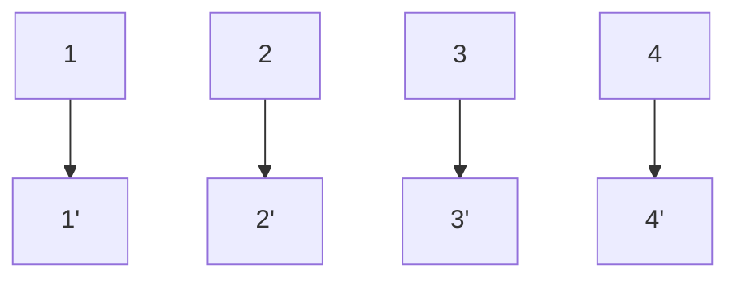
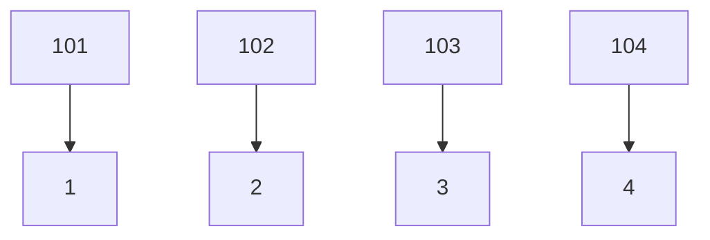

# 哈希表 (散列表) (hash table)

哈希表是一种使用哈希函数将键映射到数组中的特定位置，从而实现快速访问的数据结构。

### 情景引入

假如你有一个很大的柜子,这个柜子有很多很多的抽屉,你现在要存一个数据放到抽屉里,你不是按顺序一个一个地翻找空抽屉,而是用一个公式,根据数据算出一个抽屉编号,然后把数据放到对应地抽屉里,取得时候也一样,用同样地公式算出编号,直接打开对应编号抽屉就能拿到数据.


1. 直接定值法
2. 除留余数法

|      | 直接定址法                                                | 除留余数法                                                   |
| ---- | --------------------------------------------------------- | :----------------------------------------------------------- |
| 优点 | 简单的线性映射，不会出现冲突，只适合关键字比较连续的情况; | 可以把关键字映射到一段连续的空间上,避免了关键字分散导致的大量空间浪费 |
| 缺点 | 如果关键字太分散的话,会浪费很多空间                       | 可能会出现冲突                                               |


**冲突**: 多个关键字映射到了同一个下标上的情况（这种情况会影响散列表的性能）

**映射到同一位置的关键字就叫做同义词**


## 直接定址法(不会冲突) 

---

直接通过线性函数映射到数组下标的方式,就是直接定址法

**H(key) = key 或者 H(key) = a * key + b;** 







简单的线性映射，不会出现冲突，只适合关键字比较连续的情况; 如果关键字太分散的话,会浪费很多空间


```c
//统计字符串中出现次数最多的字母的次数
int Numsofmostappear(char* str) {
    int length = strlen(str); 
    if (length == 0) {
        return 0; 
    }
    int arr[256] = {0}; // 创建一个数组来统计所有ASCII字符， 将每一个字符与它所对应的ASCLL值的数组空间中
    
    for (int i = 0; i < length; i++) {
        unsigned char c = (unsigned char)str[i];  // char可能是有符号的
        arr[c]++;
    }
    int nums = 0; 
    for (int i = 0; i < 256; i++) {  
        nums = nums > arr[i] ? nums : arr[i]; 
    }
    return nums; 
}
```


## 除留余数法

----

让关键字对某个整数求余数，所得到的余数就作为散列地址

**H(key) = key % p;** 

> p 一般取小于等于表长的最大质数(已经有理论证明对于一个小于表长的最大质数求余,发生冲突的概率会更小)

可以把关键字映射到一段连续的空间上,避免了关键字分散导致的大量空间浪费,但可能会出现冲突

影响冲突的因素：

+ 散列函数
+ 散列表的空间利用率(装填因子)  = n(表中的元素数) / m(表长)  

> 装填因子越大,发生冲突的可能性就越大

> 装填因子越小,冲突的可能性越小,但是空间利用率越低

例如一堆数据,我们对每一个数据进行对7求余,这样就把数据都集中在了0到6的范围内.

  现在有一对数据: 6  31  0  18  29  72; 

如果使用直接定址法,就需要开辟72个空间,会造成大量空间的浪费,二采用除留余数法  方法如下

我们开辟一个大小为8个整型的数组,每一个数对7取余,就可以直接放到对应的位置，无论跨度多大的数据，都集中到了0到7的范围内

 


## 处理冲突的方法–开放定址法

---

### 线性探测法

在发生时候依次探测下一个位置,直到遇到空闲位置, 将数据插入其中(表尾的下一个空闲位置是表首)


查找：


### 平方探测法

冲突时按照 + 1^2^, - 1^2^, +2^2^, -2^2^, +3^2^, -3^2^ …的顺序进行探测，直到遇到空闲位置，将数据插入其中。(表尾之后是表首)

优点: 可以缓解堆积问题

缺点: 不一定能探测到所有散列表所有的位置 (如果表长是某个 4 * k + 3 的质数,那就一定可以探测到所有的位置 7 = 4 * 1 + 3;  11 = 4 * 2 + 3)

**查找时与填充的规则一致**, 如果要查找某个元素的时候遇到空位,那么就说明无法找到

## 处理冲突的方法–拉链法

---

把映射到同一个位置的关键字(也就是同义词)都用一个**单链表**串起来

让数组的每个元素的每个元素都包含一个头指针,就相当于一个个单链表构成的数组,在插入关键字的时候,将关键字插入到对应的单链表上,(头插和尾插均可)


这样通过除留余数法找到某个下标，可以直接在链表的后面再创建节点来添加数据，在读取的时候有也可以采用遍历链表的方法来读取。

## 删除哈希表中的元素

---

想要删除哈希表中的某个元素,也同样需要按照插入元素时的规则来删除,需要先找到元素在哈希表中位置,如果在哈希表中查找某个元素的时候遇到了空位,就说明哈希表中无法找到该元素.

解释:

- 在插入元素的时候,是按照既定的规则(线性探测法或者平方探测法)寻找空位,找到空位后将元素放到该空位上,那么在查找该元素的时候也同样按照相同的规则来查找,那么如果查找时遇到空位,如果哈希表中存在该元素,那么一定在空位之前的位置,现在查找遇到了空位,那么说明元素在放入的时候没有循环到该位置.即哈希表中不存在该元素.
  
    

当查找到该元素的位置的时候,需要在该位置上重新插入一个新的数值,而不能直接将该位置变为空位;,否则会导致后续元素的查找出错.

- 在查找该元素后面的元素的时候,当查找到该位置时为空位,错误地认为元素不在哈希表中,而不会继续向后继续查找

如果想要通过链地址法来删除哈希表中的某个元素,需要找到数组中该元素所在链表的头节点,然后遍历该链表,直到找到该元素所在的节点,直接删除该节点即可.